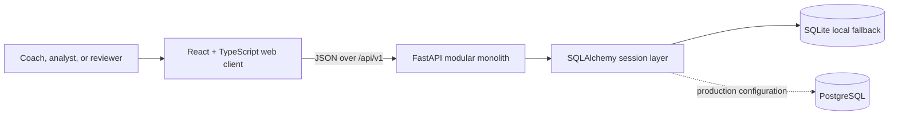
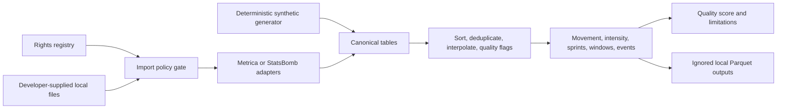
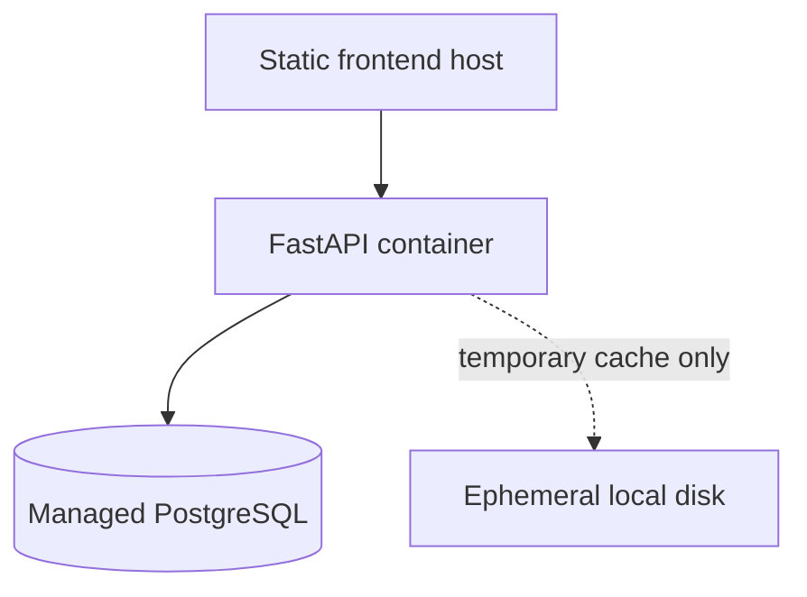

# PlayerPulse architecture

## System context



The frontend and backend are independently runnable and testable. The backend
will own data validation, analytics, persistence, and risk explanations. The
browser will receive bounded typed summaries rather than raw tracking frames.

## Current request flow

```text
Browser request
→ React Router page
→ typed Axios client (available for data-driven pages)
→ /api/v1 FastAPI route
→ Pydantic response model
→ JSON response
→ TanStack Query cache (foundation configured)
→ accessible UI state
```

At Day 2 only the system routes return data. Placeholder frontend routes do not
invent match, player, analytics, or risk content.

## Data and analytics flow



The synthetic source is the only path open by default. Metrica is local-only.
StatsBomb fails closed until the caller explicitly acknowledges a fresh rights
check. Adapters return the same provider-neutral metre/time columns, so metric
code never needs provider-specific branches.

The processing pipeline is deterministic and side-effect free unless an output
directory is explicitly supplied. Parquet is the only supported local table
format; unsafe pickle deserialization is not used. Raw, interim, processed, and
model artifacts remain ignored.

## Backend modules

- `app/main.py`: application factory, CORS middleware, logging, route assembly.
- `app/core/`: typed settings and safe structured logging.
- `app/api/routes/system.py`: liveness, readiness, and version contracts.
- `app/db/`: engine/session lifecycle and shared UUID/UTC model base.
- `app/data/registry.py`: validated source rights and fail-closed import policy.
- `app/data/importers/`: local-only provider adapters and input validation.
- `app/data/cleaning.py`: ordering, deduplication, interpolation, quality flags.
- `app/data/processing.py`: deterministic synthetic end-to-end pipeline.
- `app/data/storage.py`: safe Parquet persistence.
- `app/analytics/`: movement, zones, sprints, windows, and event metrics.
- `alembic/`: database migration environment.

These analytics remain modules in the same backend process. This modular
monolith keeps transactions and tests simple while allowing clean boundaries.

## Frontend modules

- `app/`: route configuration and global providers.
- `components/layout/`: original brand mark and responsive shell.
- `pages/`: landing, accessible placeholders, and not-found state.
- `services/api/`: isolated Axios client and typed system calls.
- `types/`: API response contracts.
- `test/`: browser-like jsdom setup.

## Deployment shape



The planned public deployment regenerates synthetic demo data and stores
durable summaries in PostgreSQL. It cannot depend on persistent local disk and
will keep third-party uploads disabled by default.
