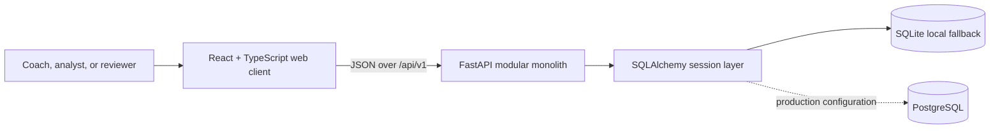
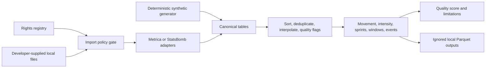
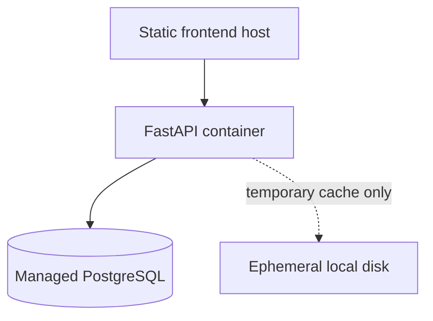

# PlayerPulse architecture

## System context


```mermaid
flowchart LR
    Reviewer[Coach, analyst, or reviewer] --> Web[React + TypeScript web client]
    Web -->|JSON over /api/v1| API[FastAPI modular monolith]
    API --> ORM[SQLAlchemy session layer]
    ORM --> SQLite[(SQLite local fallback)]
    ORM -. production configuration .-> PostgreSQL[(PostgreSQL)]
```

The frontend and backend are independently runnable and testable. The backend
will own data validation, analytics, persistence, and risk explanations. The
browser will receive bounded typed summaries rather than raw tracking frames.

## Current request flow

```text
Browser request
→ React Router page
→ typed Axios client (available for data-driven pages)
→ /api/v1 FastAPI route
→ Pydantic response model
→ JSON response
→ TanStack Query cache (foundation configured)
→ accessible UI state
```

TanStack Query caches bounded API summaries and cancels obsolete requests.
Analytical pages are route-split, expose loading/empty/error states, and use an
application error boundary. Raw tracking frames never enter the browser.

## Data and analytics flow


```mermaid
flowchart LR
    Registry[Rights registry] --> Gate[Import policy gate]
    Synthetic[Deterministic synthetic generator] --> Canonical[Canonical tables]
    Local[Developer-supplied local files] --> Gate
    Gate --> Adapters[Metrica or StatsBomb adapters]
    Adapters --> Canonical
    Canonical --> Clean[Sort, deduplicate, interpolate, quality flags]
    Clean --> Metrics[Movement, intensity, sprints, windows, events]
    Metrics --> Quality[Quality score and limitations]
    Metrics --> Parquet[Ignored local Parquet outputs]
```

The synthetic source is the only path open by default. Metrica is local-only.
StatsBomb fails closed until the caller explicitly acknowledges a fresh rights
check. Adapters return the same provider-neutral metre/time columns, so metric
code never needs provider-specific branches.

The processing pipeline is deterministic and side-effect free unless an output
directory is explicitly supplied. Parquet is the only supported local table
format; unsafe pickle deserialization is not used. Raw, interim, processed, and
model artifacts remain ignored.

## Backend modules

- `app/main.py`: application factory, CORS middleware, logging, route assembly.
- `app/core/`: typed settings and safe structured logging.
- `app/api/routes/system.py`: liveness, readiness, and version contracts.
- `app/api/routes/`: datasets, jobs, matches, players, comparisons, and risk.
- `app/db/`: engine/session lifecycle and shared UUID/UTC model base.
- `app/data/registry.py`: validated source rights and fail-closed import policy.
- `app/data/importers/`: local-only provider adapters and input validation.
- `app/data/cleaning.py`: ordering, deduplication, interpolation, quality flags.
- `app/data/processing.py`: deterministic synthetic end-to-end pipeline.
- `app/data/storage.py`: safe Parquet persistence.
- `app/analytics/`: movement, zones, sprints, windows, and event metrics.
- `alembic/`: database migration environment.
- `app/services/`: demo persistence, processing orchestration, baselines, and
  explainable risk evaluation.
- `app/repositories/`: transactional, idempotent database access.

These analytics remain modules in the same backend process. This modular
monolith keeps transactions and tests simple while allowing clean boundaries.

## Frontend modules

- `app/`: route configuration and global providers.
- `components/layout/`: original brand mark and responsive shell.
- `pages/`: landing, dashboard, matches, player analysis, comparison, data,
  methodology, ethics, about, and not-found states.
- `services/api/`: isolated Axios clients for system and analytical routes.
- `types/`: API response contracts.
- `test/`: browser-like jsdom setup.

## Deployment shape


```mermaid
flowchart TB
    Static[Static frontend host] --> Container[FastAPI container]
    Container --> ManagedDB[(Managed PostgreSQL)]
    Container -. temporary cache only .-> Disk[Ephemeral local disk]
```

The production shape regenerates synthetic demo data and stores durable
summaries in PostgreSQL. It cannot depend on persistent local disk and keeps
third-party uploads disabled by default. CI proves SQLite and PostgreSQL
migrations separately.

## Trust boundaries

```text
Untrusted browser or local file
→ bounded FastAPI validation and rights gate
→ canonical in-memory tables
→ deterministic analytics
→ SQLAlchemy transaction
→ bounded response schema
→ escaped React rendering
```

External adapters never fetch provider data. Upload names are reduced to safe
basenames, size is enforced while streaming, and pickle/Joblib input is
prohibited. Production configuration rejects insecure CORS origins. The API
and Nginx add defense-in-depth response headers; authentication and tenancy
remain explicitly outside this portfolio MVP.
